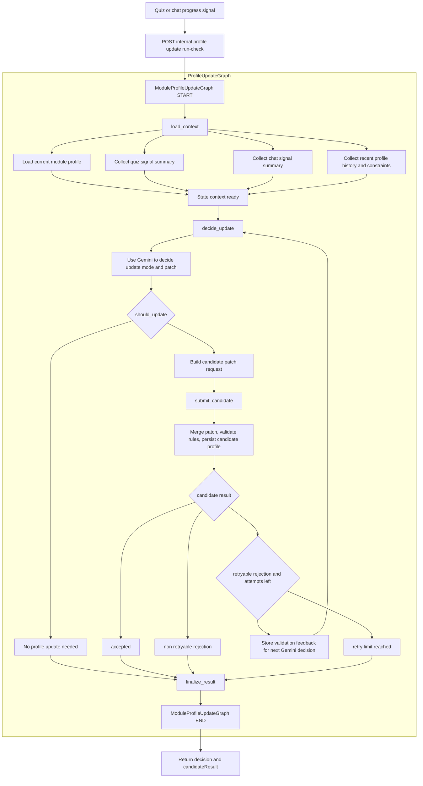

```mermaid
flowchart TD
  Trigger["Quiz or chat progress signal"] --> API["POST internal profile update run-check"]
  API --> Start["ModuleProfileUpdateGraph START"]

  subgraph ProfileUpdateGraph
    Start --> Load["load_context"]

    Load --> BaseProfile["Load current module profile"]
    Load --> QuizSignal["Collect quiz signal summary"]
    Load --> ChatSignal["Collect chat signal summary"]
    Load --> History["Collect recent profile history and constraints"]

    BaseProfile --> ContextReady["State context ready"]
    QuizSignal --> ContextReady
    ChatSignal --> ContextReady
    History --> ContextReady

    ContextReady --> Decide["decide_update"]
    Decide --> DecideWork["Use Gemini to decide update mode and patch"]
    DecideWork --> ShouldUpdate{"should_update"}

    ShouldUpdate --> NoUpdate["No profile update needed"]
    NoUpdate --> Finalize["finalize_result"]

    ShouldUpdate --> BuildCandidate["Build candidate patch request"]
    BuildCandidate --> Submit["submit_candidate"]
    Submit --> CandidateWork["Merge patch, validate rules, persist candidate profile"]
    CandidateWork --> CandidateResult{"candidate result"}

    CandidateResult --> Accepted["accepted"]
    Accepted --> Finalize

    CandidateResult --> NonRetryable["non retryable rejection"]
    NonRetryable --> Finalize

    CandidateResult --> Retryable{"retryable rejection and attempts left"}
    Retryable --> RetryFeedback["Store validation feedback for next Gemini decision"]
    RetryFeedback --> Decide
    Retryable --> Exhausted["retry limit reached"]
    Exhausted --> Finalize

    Finalize --> End["ModuleProfileUpdateGraph END"]
  end

  End --> Response["Return decision and candidateResult"]
```
