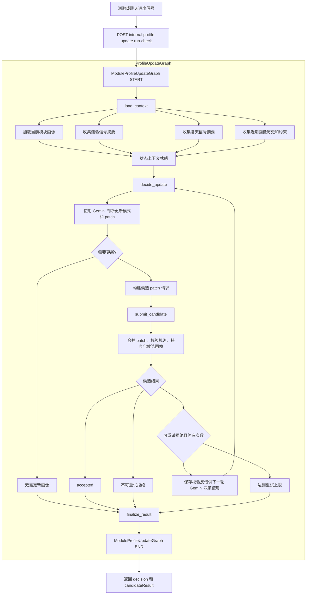

# 学习画像更新工作流

English version: [profile-update-workflow.en.md](profile-update-workflow.en.md)

```mermaid
flowchart TD
  Trigger["测验或聊天进度信号"] --> API["POST internal profile update run-check"]
  API --> Start["ModuleProfileUpdateGraph START"]

  subgraph ProfileUpdateGraph
    Start --> Load["load_context"]

    Load --> BaseProfile["加载当前模块画像"]
    Load --> QuizSignal["收集测验信号摘要"]
    Load --> ChatSignal["收集聊天信号摘要"]
    Load --> History["收集近期画像历史和约束"]

    BaseProfile --> ContextReady["状态上下文就绪"]
    QuizSignal --> ContextReady
    ChatSignal --> ContextReady
    History --> ContextReady

    ContextReady --> Decide["decide_update"]
    Decide --> DecideWork["使用 Gemini 判断更新模式和 patch"]
    DecideWork --> ShouldUpdate{"需要更新?"}

    ShouldUpdate --> NoUpdate["无需更新画像"]
    NoUpdate --> Finalize["finalize_result"]

    ShouldUpdate --> BuildCandidate["构建候选 patch 请求"]
    BuildCandidate --> Submit["submit_candidate"]
    Submit --> CandidateWork["合并 patch、校验规则、持久化候选画像"]
    CandidateWork --> CandidateResult{"候选结果"}

    CandidateResult --> Accepted["accepted"]
    Accepted --> Finalize

    CandidateResult --> NonRetryable["不可重试拒绝"]
    NonRetryable --> Finalize

    CandidateResult --> Retryable{"可重试拒绝且仍有次数"}
    Retryable --> RetryFeedback["保存校验反馈供下一轮 Gemini 决策使用"]
    RetryFeedback --> Decide
    Retryable --> Exhausted["达到重试上限"]
    Exhausted --> Finalize

    Finalize --> End["ModuleProfileUpdateGraph END"]
  end

  End --> Response["返回 decision 和 candidateResult"]
```
