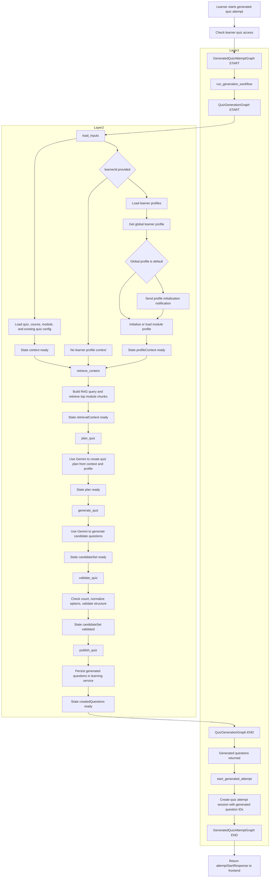

```mermaid
flowchart TD
  User["Learner starts generated quiz attempt"] --> Access["Check learner quiz access"]
  Access --> OuterStart["GeneratedQuizAttemptGraph START"]

  subgraph Layer1
    OuterStart --> RunGen["run_generation_workflow"]
    RunGen --> InnerStart["QuizGenerationGraph START"]
    InnerEnd["QuizGenerationGraph END"] --> GenResult["Generated questions returned"]
    GenResult --> StartAttempt["start_generated_attempt"]
    StartAttempt --> Attempt["Create quiz attempt session with generated question IDs"]
    Attempt --> OuterEnd["GeneratedQuizAttemptGraph END"]
  end

  subgraph Layer2
    InnerStart --> LoadInputs["load_inputs"]

    LoadInputs --> LoadQuizContext["Load quiz, course, module, and existing quiz config"]
    LoadQuizContext --> ContextReady["State context ready"]

    LoadInputs --> HasLearner{"learnerId provided"}
    HasLearner --> NoProfile["No learner profile context"]
    HasLearner --> LoadProfiles["Load learner profiles"]

    LoadProfiles --> GlobalProfile["Get global learner profile"]
    GlobalProfile --> IsDefault{"Global profile is default"}
    IsDefault --> Notify["Send profile initialization notification"]
    IsDefault --> ModuleProfile["Initialize or load module profile"]
    Notify --> ModuleProfile
    ModuleProfile --> ProfileReady["State profileContext ready"]

    ContextReady --> Retrieve["retrieve_context"]
    NoProfile --> Retrieve
    ProfileReady --> Retrieve

    Retrieve --> RetrieveWork["Build RAG query and retrieve top module chunks"]
    RetrieveWork --> RetrievalReady["State retrievalContext ready"]

    RetrievalReady --> Plan["plan_quiz"]
    Plan --> PlanWork["Use Gemini to create quiz plan from context and profile"]
    PlanWork --> PlanReady["State plan ready"]

    PlanReady --> Generate["generate_quiz"]
    Generate --> GenerateWork["Use Gemini to generate candidate questions"]
    GenerateWork --> CandidateReady["State candidateSet ready"]

    CandidateReady --> Validate["validate_quiz"]
    Validate --> ValidateWork["Check count, normalize options, validate structure"]
    ValidateWork --> ValidReady["State candidateSet validated"]

    ValidReady --> Publish["publish_quiz"]
    Publish --> PublishWork["Persist generated questions in learning service"]
    PublishWork --> CreatedQuestions["State createdQuestions ready"]
    CreatedQuestions --> InnerEnd
  end

  OuterEnd --> Result["Return attemptStartResponse to frontend"]
```
