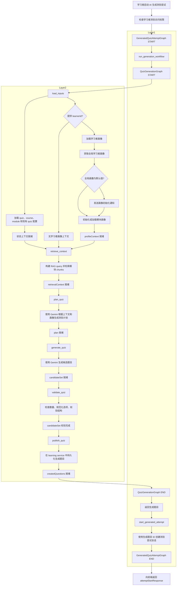

# AI 测验生成工作流

English version: [quiz-generation-workflow.en.md](quiz-generation-workflow.en.md)

```mermaid
flowchart TD
  User["学习者启动 AI 生成测验尝试"] --> Access["检查学习者测验访问权限"]
  Access --> OuterStart["GeneratedQuizAttemptGraph START"]

  subgraph Layer1
    OuterStart --> RunGen["run_generation_workflow"]
    RunGen --> InnerStart["QuizGenerationGraph START"]
    InnerEnd["QuizGenerationGraph END"] --> GenResult["返回生成题目"]
    GenResult --> StartAttempt["start_generated_attempt"]
    StartAttempt --> Attempt["使用生成题目 ID 创建测验尝试会话"]
    Attempt --> OuterEnd["GeneratedQuizAttemptGraph END"]
  end

  subgraph Layer2
    InnerStart --> LoadInputs["load_inputs"]

    LoadInputs --> LoadQuizContext["加载 quiz、course、module 和现有 quiz 配置"]
    LoadQuizContext --> ContextReady["状态上下文就绪"]

    LoadInputs --> HasLearner{"提供 learnerId?"}
    HasLearner --> NoProfile["无学习者画像上下文"]
    HasLearner --> LoadProfiles["加载学习者画像"]

    LoadProfiles --> GlobalProfile["获取全局学习者画像"]
    GlobalProfile --> IsDefault{"全局画像为默认值?"}
    IsDefault --> Notify["发送画像初始化通知"]
    IsDefault --> ModuleProfile["初始化或加载模块画像"]
    Notify --> ModuleProfile
    ModuleProfile --> ProfileReady["profileContext 就绪"]

    ContextReady --> Retrieve["retrieve_context"]
    NoProfile --> Retrieve
    ProfileReady --> Retrieve

    Retrieve --> RetrieveWork["构建 RAG query 并检索模块 chunks"]
    RetrieveWork --> RetrievalReady["retrievalContext 就绪"]

    RetrievalReady --> Plan["plan_quiz"]
    Plan --> PlanWork["使用 Gemini 根据上下文和画像生成测验计划"]
    PlanWork --> PlanReady["plan 就绪"]

    PlanReady --> Generate["generate_quiz"]
    Generate --> GenerateWork["使用 Gemini 生成候选题目"]
    GenerateWork --> CandidateReady["candidateSet 就绪"]

    CandidateReady --> Validate["validate_quiz"]
    Validate --> ValidateWork["检查数量、规范化选项、校验结构"]
    ValidateWork --> ValidReady["candidateSet 校验完成"]

    ValidReady --> Publish["publish_quiz"]
    Publish --> PublishWork["在 learning service 中持久化生成题目"]
    PublishWork --> CreatedQuestions["createdQuestions 就绪"]
    CreatedQuestions --> InnerEnd
  end

  OuterEnd --> Result["向前端返回 attemptStartResponse"]
```
