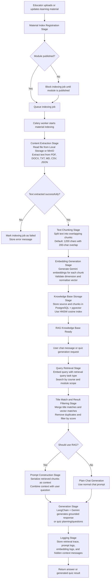

```mermaid
flowchart TD
    A[Educator uploads or updates learning material] --> B[Material Index Registration Stage]
    B --> C{Module published?}
    C -- Yes --> D[Queue indexing job]
    C -- No --> E[Block indexing job until module is published]
    E --> D

    D --> F[Celery worker starts material indexing]
    F --> G[Content Extraction Stage<br/>Read file from Local Storage or MinIO<br/>Extract text from PDF, DOCX, TXT, MD, CSV, JSON]

    G --> H{Text extracted successfully?}
    H -- No --> H1[Mark indexing job as failed<br/>Store error message]
    H -- Yes --> I[Text Chunking Stage<br/>Split text into overlapping chunks<br/>Default: 1200 chars with 200-char overlap]

    I --> J[Embedding Generation Stage<br/>Generate Gemini embeddings for each chunk<br/>Validate dimension and normalise vector]

    J --> K[Knowledge Base Storage Stage<br/>Store source and chunks in PostgreSQL + pgvector<br/>Use HNSW cosine index]

    K --> L[RAG Knowledge Base Ready]

    L --> M[User chat message or quiz generation request]
    M --> N[Query Retrieval Stage<br/>Embed query with retrieval query task type<br/>Search by course and module scope]

    N --> O[Title Match and Result Filtering Stage<br/>Merge title matches and vector matches<br/>Remove duplicates and filter by score]

    O --> P{Should use RAG?}
    P -- No --> Q[Plain Chat Generation<br/>Use normal chat prompt]
    P -- Yes --> R[Prompt Construction Stage<br/>Serialize retrieved chunks as context<br/>Combine context with user question]

    R --> S[Generation Stage<br/>LangChain + Gemini generates grounded response<br/>or quiz planning/questions]
    Q --> S

    S --> T[Logging Stage<br/>Store retrieval trace, prompt logs,<br/>embedding logs, and hidden context messages]

    T --> U[Return answer or generated quiz result]

```