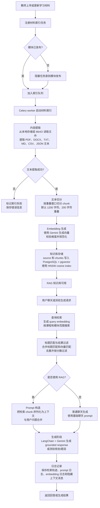

# RAG 与材料索引工作流

English version: [rag-workflow.en.md](rag-workflow.en.md)

```mermaid
flowchart TD
    A[教师上传或更新学习材料] --> B[注册材料索引任务]
    B --> C{模块已发布?}
    C -- 是 --> D[加入索引队列]
    C -- 否 --> E[阻塞任务直到模块发布]
    E --> D

    D --> F[Celery worker 启动材料索引]
    F --> G[内容提取<br/>从本地存储或 MinIO 读取文件<br/>提取 PDF、DOCX、TXT、MD、CSV、JSON 文本]

    G --> H{文本提取成功?}
    H -- 否 --> H1[标记索引失败<br/>保存错误信息]
    H -- 是 --> I[文本切分<br/>按重叠窗口切分 chunk<br/>默认 1200 字符，200 字符重叠]

    I --> J[Embedding 生成<br/>使用 Gemini 生成向量<br/>校验维度并规范化]

    J --> K[知识库存储<br/>source 和 chunks 写入 PostgreSQL + pgvector<br/>使用 HNSW cosine index]

    K --> L[RAG 知识库可用]

    L --> M[用户聊天或测验生成请求]
    M --> N[查询检索<br/>生成 query embedding<br/>按课程和模块范围搜索]

    N --> O[标题匹配与结果过滤<br/>合并标题匹配和向量匹配<br/>去重并按分数过滤]

    O --> P{是否使用 RAG?}
    P -- 否 --> Q[普通聊天生成<br/>使用基础聊天 prompt]
    P -- 是 --> R[Prompt 构造<br/>把检索 chunk 序列化为上下文<br/>与用户问题合并]

    R --> S[生成阶段<br/>LangChain + Gemini 生成 grounded response<br/>或测验规划/题目]
    Q --> S

    S --> T[日志记录<br/>保存检索轨迹、prompt 日志、embedding 日志和隐藏上下文消息]

    T --> U[返回回答或生成结果]
```
