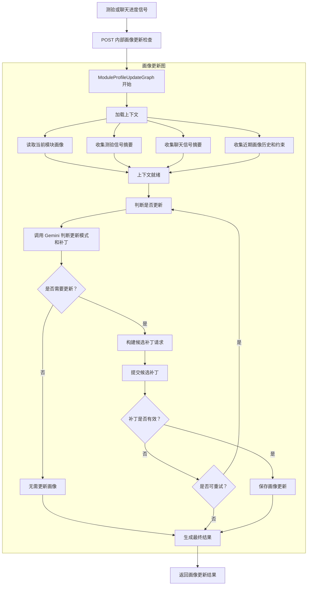

```mermaid
flowchart TD
  Trigger["测验或聊天进度信号"] --> API["POST 内部画像更新检查"]
  API --> Start["ModuleProfileUpdateGraph 开始"]

  subgraph ProfileUpdateGraph["画像更新图"]
    Start --> Load["加载上下文"]
    Load --> BaseProfile["读取当前模块画像"]
    Load --> QuizSignal["收集测验信号摘要"]
    Load --> ChatSignal["收集聊天信号摘要"]
    Load --> History["收集近期画像历史和约束"]

    BaseProfile --> ContextReady["上下文就绪"]
    QuizSignal --> ContextReady
    ChatSignal --> ContextReady
    History --> ContextReady

    ContextReady --> Decide["判断是否更新"]
    Decide --> DecideWork["调用 Gemini 判断更新模式和补丁"]
    DecideWork --> ShouldUpdate{"是否需要更新？"}

    ShouldUpdate -- "否" --> NoUpdate["无需更新画像"]
    NoUpdate --> Finalize["生成最终结果"]

    ShouldUpdate -- "是" --> BuildCandidate["构建候选补丁请求"]
    BuildCandidate --> SubmitCandidate["提交候选补丁"]
    SubmitCandidate --> Validate{"补丁是否有效？"}
    Validate -- "否" --> Retry{"是否可重试？"}
    Retry -- "是" --> Decide
    Retry -- "否" --> Finalize
    Validate -- "是" --> Persist["保存画像更新"]
    Persist --> Finalize
  end

  Finalize --> Result["返回画像更新结果"]
```
