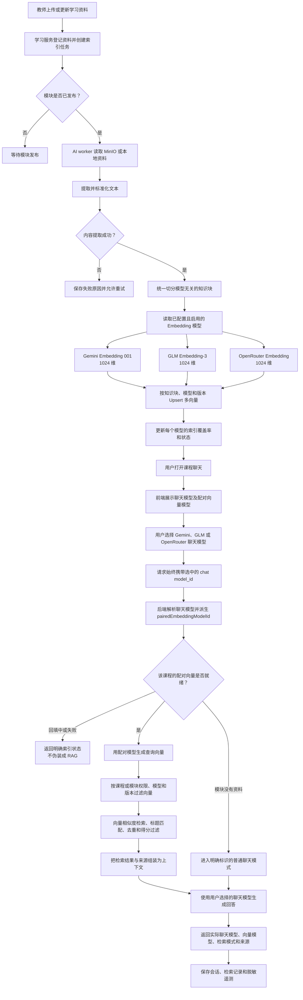

# 检索增强生成流程图

用户只选择聊天模型。后端从受控模型目录派生对应的向量模型，并在同一资料的多套 1024 维向量中选择匹配的向量空间。

约束：

- 维度相同的不同模型也不能混用向量。
- 新增 Provider Key 后，为现有知识块异步回填该 Provider 的向量；用户切换模型不会临时重新切分资料。
- 一个 Provider 的索引失败不影响其他 Provider 已经完成的向量。
- AI 测验检索使用管理员默认聊天模型配对的向量模型；向量未就绪时返回结构化错误。
