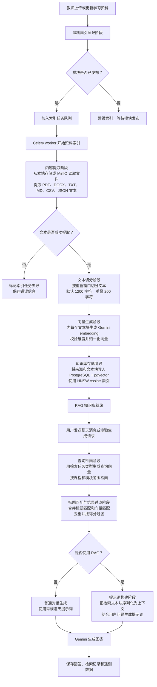

```mermaid
flowchart TD
    A["教师上传或更新学习资料"] --> B["资料索引登记阶段"]
    B --> C{"模块是否已发布？"}
    C -- "是" --> D["加入索引任务队列"]
    C -- "否" --> E["暂缓索引，等待模块发布"]

    D --> F["Celery worker 开始资料索引"]
    F --> G["内容提取阶段<br/>从本地存储或 MinIO 读取文件<br/>提取 PDF、DOCX、TXT、MD、CSV、JSON 文本"]

    G --> H{"文本是否成功提取？"}
    H -- "否" --> H1["标记索引任务失败<br/>保存错误信息"]
    H -- "是" --> I["文本切分阶段<br/>按重叠窗口切分文本<br/>默认 1200 字符，重叠 200 字符"]

    I --> J["向量生成阶段<br/>为每个文本块生成 Gemini embedding<br/>校验维度并归一化向量"]

    J --> K["知识库存储阶段<br/>将来源和文本块写入 PostgreSQL + pgvector<br/>使用 HNSW cosine 索引"]

    K --> L["RAG 知识库就绪"]

    L --> M["用户发送聊天消息或测验生成请求"]
    M --> N["查询检索阶段<br/>用检索任务类型生成查询向量<br/>按课程和模块范围检索"]

    N --> O["标题匹配与结果过滤阶段<br/>合并标题匹配和向量匹配<br/>去重并按得分过滤"]

    O --> P{"是否使用 RAG？"}
    P -- "否" --> Q["普通对话生成<br/>使用常规聊天提示词"]
    P -- "是" --> R["提示词构建阶段<br/>把检索文本块序列化为上下文<br/>结合用户问题生成提示词"]

    Q --> S["Gemini 生成回答"]
    R --> S
    S --> T["保存回答、检索记录和遥测数据"]
```
