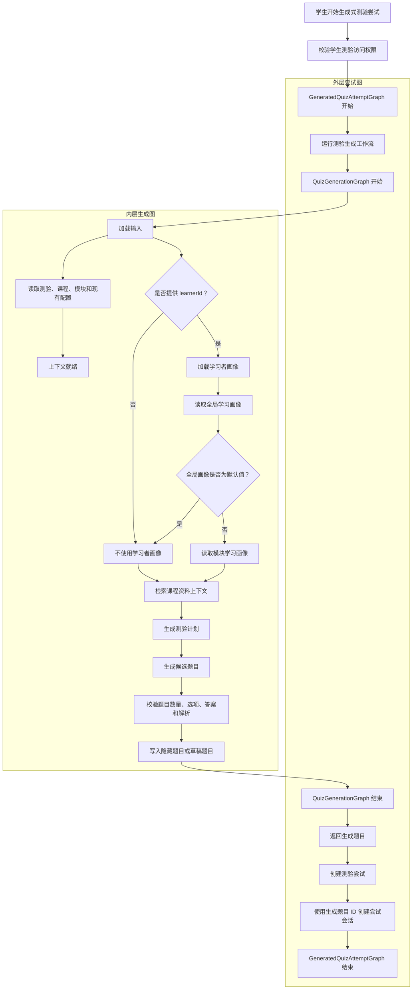

```mermaid
flowchart TD
  User["学生开始生成式测验尝试"] --> Access["校验学生测验访问权限"]
  Access --> OuterStart["GeneratedQuizAttemptGraph 开始"]

  subgraph Layer1["外层尝试图"]
    OuterStart --> RunGen["运行测验生成工作流"]
    RunGen --> InnerStart["QuizGenerationGraph 开始"]
    InnerEnd["QuizGenerationGraph 结束"] --> GenResult["返回生成题目"]
    GenResult --> StartAttempt["创建测验尝试"]
    StartAttempt --> Attempt["使用生成题目 ID 创建尝试会话"]
    Attempt --> OuterEnd["GeneratedQuizAttemptGraph 结束"]
  end

  subgraph Layer2["内层生成图"]
    InnerStart --> LoadInputs["加载输入"]
    LoadInputs --> LoadQuizContext["读取测验、课程、模块和现有配置"]
    LoadQuizContext --> ContextReady["上下文就绪"]

    LoadInputs --> HasLearner{"是否提供 learnerId？"}
    HasLearner -- "否" --> NoProfile["不使用学习者画像"]
    HasLearner -- "是" --> LoadProfiles["加载学习者画像"]
    LoadProfiles --> GlobalProfile["读取全局学习画像"]
    GlobalProfile --> IsDefault{"全局画像是否为默认值？"}
    IsDefault -- "是" --> NoProfile
    IsDefault -- "否" --> ModuleProfile["读取模块学习画像"]

    NoProfile --> Retrieve["检索课程资料上下文"]
    ModuleProfile --> Retrieve
    Retrieve --> Plan["生成测验计划"]
    Plan --> Generate["生成候选题目"]
    Generate --> Validate["校验题目数量、选项、答案和解析"]
    Validate --> Publish["写入隐藏题目或草稿题目"]
    Publish --> InnerEnd
  end
```
